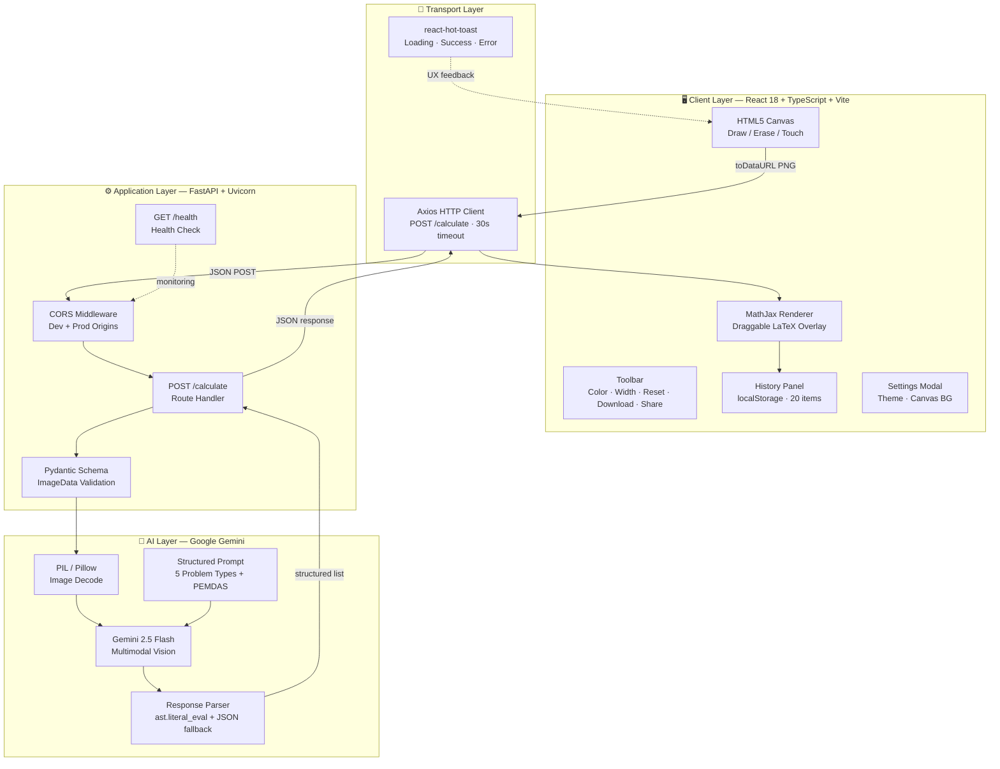
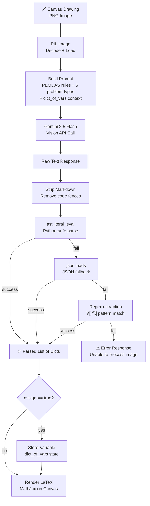
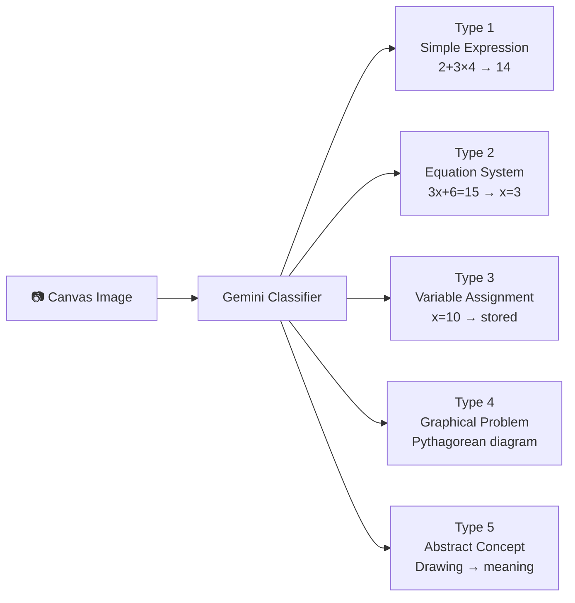
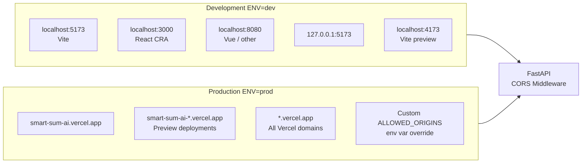
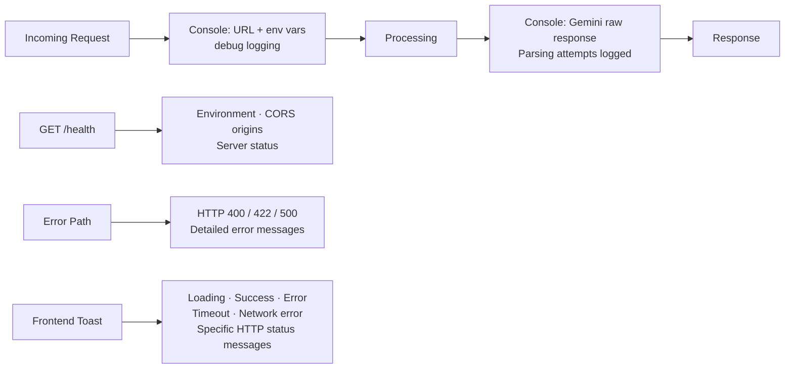

<div align="center">

<br/>

```
███████╗███╗   ███╗ █████╗ ██████╗ ████████╗███████╗██╗   ██╗███╗   ███╗     █████╗ ██╗
██╔════╝████╗ ████║██╔══██╗██╔══██╗╚══██╔══╝██╔════╝██║   ██║████╗ ████║    ██╔══██╗██║
███████╗██╔████╔██║███████║██████╔╝   ██║   ███████╗██║   ██║██╔████╔██║    ███████║██║
╚════██║██║╚██╔╝██║██╔══██║██╔══██╗   ██║   ╚════██║██║   ██║██║╚██╔╝██║    ██╔══██║██║
███████║██║ ╚═╝ ██║██║  ██║██║  ██║   ██║   ███████║╚██████╔╝██║ ╚═╝ ██║    ██║  ██║██║
╚══════╝╚═╝     ╚═╝╚═╝  ╚═╝╚═╝  ╚═╝   ╚═╝   ╚══════╝ ╚═════╝ ╚═╝     ╚═╝    ╚═╝  ╚═╝╚═╝
```

### *Draw. Compute. Understand.*

**SmartSum AI** is a full-stack, multimodal AI system that understands hand-drawn mathematical expressions on a digital canvas and returns precise, rendered results — powered by **Google Gemini 2.5 Flash Vision**.

<br/>

[](https://fastapi.tiangolo.com/)
[](https://react.dev/)
[](https://www.typescriptlang.org/)
[](https://python.org/)
[](https://ai.google.dev/)
[](https://vitejs.dev/)

<br/>

[](https://github.com/viRAJ357/CENTURIONMINORPROJECTSMARTSUMAI)
[](https://smartsum-ai-backend.onrender.com)
[](https://smart-sum-ai.vercel.app/)
[](LICENSE)
[](https://github.com/viRAJ357)

<br/>

> ### 🟢 &nbsp;[**LIVE DEMO → smart-sum-ai.vercel.app**](https://smart-sum-ai.vercel.app/) &nbsp;&nbsp; `Deployed & Running`

<br/>

[**🚀 Live Demo**](https://smart-sum-ai.vercel.app/) &nbsp;·&nbsp; [**📡 Live API**](https://smartsum-ai-backend.onrender.com/docs) &nbsp;·&nbsp; [**🏗️ Architecture**](#system-architecture) &nbsp;·&nbsp; [**⚡ Quick Start**](#quick-start)

<br/>

</div>

---

## Pipeline Overview

```
┌─────────────────────────────────────────────────────────────────────────────────────┐
│                                                                                     │
│    🖊️  DRAW          📸  CAPTURE         🧠  ANALYZE          ✨  RENDER            │
│                                                                                     │
│   ┌──────────┐      ┌──────────┐       ┌──────────┐        ┌──────────┐           │
│   │          │      │          │       │          │        │          │           │
│   │  Canvas  │ ───▶ │  base64  │ ───▶  │  Gemini  │ ────▶  │  LaTeX   │           │
│   │  (HTML5) │      │  Image   │       │  Vision  │        │  Output  │           │
│   │          │      │          │       │  AI API  │        │  Canvas  │           │
│   └──────────┘      └──────────┘       └──────────┘        └──────────┘           │
│                                                                                     │
│      Mouse /            PNG               Structured           MathJax              │
│      Touch Input        Payload           JSON Result          Rendered             │
│                                                                                     │
└─────────────────────────────────────────────────────────────────────────────────────┘
```

---

## Project Overview

Traditional calculators require users to type expressions using keyboards — an unnatural constraint when working with complex equations, diagrams, or word problems represented visually.

**SmartSum AI** solves this by treating math as a **visual language**. Users draw freely on a canvas (mouse or touch), and the system interprets the drawing using Google's multimodal vision model, returning structured results rendered as LaTeX directly on the canvas.

The system handles five distinct problem types without any special mode switching — the AI classifies the input automatically.

**Intended users:** Students, educators, engineers, and researchers who need a frictionless, natural interface for mathematical computation.

---

## Problem → Solution

```mermaid
flowchart LR
    A["❌ Typed Input\nSlow & unnatural"] -->|replaced by| B["🖊️ Drawn Input\nHTML5 Canvas"]
    B -->|captured as| C["📸 PNG Image\nbase64 encoded"]
    C -->|sent to| D["⚡ FastAPI\nPOST /calculate"]
    D -->|processed by| E["🧠 Gemini 2.5 Flash\nVision Model"]
    E -->|returns| F["📋 Structured JSON\nexpr + result + assign"]
    F -->|validated & parsed| G["✅ LaTeX Result\nRendered on Canvas"]
    G -->|stored in| H["💾 History\nlocalStorage"]
```



---

## System Architecture



---

## AI Decision Flow



> **Design principle:** The AI model generates candidate results. A deterministic parser with multiple fallback strategies validates and structures the output before it reaches the frontend. The model never directly controls what is rendered — the parser does.

---

## Key Features

### 🧠 AI Intelligence
- **Gemini 2.5 Flash** multimodal vision — understands handwritten math, not just printed text
- **5 problem type auto-classification** — no mode switching required
- **Variable state tracking** — assigns `x = 4` and reuses it in subsequent expressions
- **PEMDAS-aware prompting** — order of operations enforced in prompt engineering

### 🎨 Canvas Interface
- **Mouse and touch support** — works on tablet and desktop
- **Adjustable pen width** — fine to thick strokes
- **Color swatches** — 12 preset colors + custom picker
- **Eraser tool** — partial erase without clearing canvas
- **Download as PNG** — save the annotated canvas
- **Web Share API** — native share on supported devices

### 📋 Result Management
- **Draggable LaTeX overlays** — reposition results anywhere on canvas
- **Calculation history** — last 20 calculations persisted in `localStorage`
- **Multi-result support** — multiple expressions solved simultaneously with stagger animation
- **Dark / Light theme** — canvas background adapts

### ⚡ Reliability
- **3-tier response parsing** — `ast.literal_eval` → `json.loads` → regex fallback
- **30-second request timeout** — handles slow Gemini response on free tier
- **Graceful error messages** — specific error for 404, 500, 422, timeout, network failure
- **CORS-safe** — dev and production origins preconfigured

### 📡 API
- **FastAPI** with automatic Swagger UI at `/docs`
- **GET /health** endpoint for uptime monitoring
- **Pydantic schema validation** on all incoming requests
- **Hot-reload** in development via Uvicorn

---

## Tech Stack

| Layer | Technology | Version | Purpose |
|-------|-----------|---------|---------|
| **Frontend** | React | 18.3 | Component-based UI |
| **Language** | TypeScript | 5.7 | Type-safe frontend |
| **Build Tool** | Vite | 6.3 | Fast dev server + bundler |
| **Styling** | Tailwind CSS | 3.4 | Utility-first CSS |
| **UI Components** | Mantine | 7.17 | Tooltips, theming |
| **HTTP Client** | Axios | 1.8 | API communication |
| **Math Rendering** | MathJax | 2.7.9 | LaTeX typesetting |
| **Routing** | React Router | 7.4 | Client-side routing |
| **Drag** | React Draggable | 4.5 | Moveable result labels |
| **Notifications** | react-hot-toast | 2.6 | UX feedback toasts |
| **Icons** | Lucide React | 0.48 | UI icons |
| **Backend** | FastAPI | 0.115 | REST API framework |
| **Server** | Uvicorn | 0.34 | ASGI server |
| **AI SDK** | google-generativeai | 0.8.4 | Gemini API client |
| **Image Processing** | Pillow | 11.1 | PNG decode |
| **Validation** | Pydantic | 2.10 | Request schema |
| **Config** | python-dotenv | 1.0 | Environment variables |
| **AI Model** | Gemini 2.5 Flash | — | Multimodal vision |
| **Frontend Deploy** | Vercel | — | CDN + edge functions |
| **Backend Deploy** | Render | — | Python web service |

---

## API Reference

### Health Check

```http
GET /health
```

```json
{
  "status": "healthy",
  "message": "API is working",
  "environment": "dev",
  "cors_origins": ["http://localhost:5173", "..."]
}
```

---

### Solve Expression

```http
POST /calculate
Content-Type: application/json
```

**Request**

```json
{
  "image": "data:image/png;base64,iVBORw0KGgo...",
  "dict_of_vars": {
    "x": 4,
    "y": 10
  }
}
```

| Field | Type | Required | Description |
|-------|------|----------|-------------|
| `image` | `string` | ✅ | Base64-encoded PNG from `canvas.toDataURL()` |
| `dict_of_vars` | `object` | ✅ | Currently assigned variable values (can be `{}`) |

**Response — Success**

```json
{
  "message": "Image Processed",
  "type": "success",
  "data": [
    {
      "expr": "2 + 3 \\times 4",
      "result": "14",
      "assign": false
    }
  ]
}
```

**Response — Variable Assignment**

```json
{
  "data": [
    {
      "expr": "x",
      "result": "5",
      "assign": true
    }
  ]
}
```

**Response Fields**

| Field | Type | Description |
|-------|------|-------------|
| `expr` | `string` | The expression or variable name |
| `result` | `string` | The computed result |
| `assign` | `boolean` | If `true`, store `expr` as variable with value `result` |

**Error Codes**

| Code | Meaning |
|------|---------|
| `400` | Image could not be opened by PIL |
| `422` | Request body failed Pydantic schema validation |
| `500` | Gemini API error or unexpected server error |

---

## Problem Types Supported



---

## Project Structure

```
CENTURIONMINORPROJECTSMARTSUMAI/
│
├── 📁 frontend/                        React + TypeScript + Vite
│   ├── 📁 src/
│   │   ├── 📁 screens/
│   │   │   └── 📁 home/
│   │   │       └── index.tsx           Main canvas screen (1240 lines)
│   │   ├── 📁 components/
│   │   │   └── 📁 ui/
│   │   │       └── button.tsx          Reusable button component
│   │   ├── 📁 lib/
│   │   │   ├── constants.ts            Color swatches
│   │   │   └── utils.ts               Utility functions
│   │   ├── App.tsx                     Root component + MantineProvider
│   │   ├── main.tsx                    React DOM entry point
│   │   └── index.css                   Global styles + glass-panel
│   ├── 📁 public/
│   │   ├── SM1png.png                  App screenshots
│   │   ├── SM2.png
│   │   ├── SM3.png
│   │   └── SM4.png
│   ├── index.html
│   ├── package.json
│   ├── vite.config.ts
│   ├── tailwind.config.ts
│   ├── tsconfig.json
│   └── .env.example
│
├── 📁 backend/                         FastAPI + Python 3.13
│   ├── 📁 apps/
│   │   └── 📁 calculator/
│   │       ├── route.py                POST /calculate handler
│   │       └── utils.py               Gemini vision + response parser
│   ├── main.py                         FastAPI app + CORS configuration
│   ├── constants.py                    Env vars + allowed origins
│   ├── schema.py                       Pydantic ImageData schema
│   ├── requirements.txt               Python dependencies
│   ├── runtime.txt                     Python 3.13 declaration
│   ├── render.yaml                     Render.com deployment config
│   └── .env.example                   Environment template
│
└── README.md
```

---

## Quick Start

### Prerequisites

- Python **3.13**
- Node.js **18+**
- Google Gemini API Key → [aistudio.google.com/app/apikey](https://aistudio.google.com/app/apikey)

---

### Backend

```bash
cd backend

# Create virtual environment
py -3.13 -m venv venv
```

**Windows**
```powershell
.\venv\Scripts\activate
```

**macOS / Linux**
```bash
source venv/bin/activate
```

```bash
pip install -r requirements.txt

# Configure environment
cp .env.example .env
# Edit .env — set GEMINI_API_KEY

python main.py
```

Backend available at: `http://localhost:8900`
Swagger UI: `http://localhost:8900/docs`

---

### Frontend

```bash
cd frontend

npm install

cp .env.example .env.local
# Set: VITE_API_URL=http://localhost:8900

npm run dev
```

Application available at: `http://localhost:5173`

---

## Environment Variables

**backend/.env**

```env
GEMINI_API_KEY=your_gemini_api_key_here
ENV=dev
SERVER_URL=localhost
PORT=8900
```

**frontend/.env.local**

```env
# Local development
VITE_API_URL=http://localhost:8900

# Production
# VITE_API_URL=https://smartsum-ai-backend.onrender.com
```

---

## CORS Configuration



---

## Observability



**Health endpoint** returns environment, version, and CORS origins — useful for deployment verification.

**Frontend error handling** distinguishes between: network failure, connection timeout, 404, 422 validation error, and 500 server error — each with a specific user-facing message.

---

## Security

| Control | Implementation | Status |
|---------|---------------|--------|
| Input validation | Pydantic `ImageData` schema on all POST requests | ✅ |
| CORS policy | Origin whitelist — dev and prod separated | ✅ |
| Secrets management | `.env` file — never committed to version control | ✅ |
| API key isolation | `GEMINI_API_KEY` only on server — never exposed to frontend | ✅ |
| Error sanitization | HTTP exceptions return structured errors, not raw tracebacks | ✅ |
| Image validation | PIL raises `HTTPException 400` if image cannot be decoded | ✅ |

---

## Deployment

### Backend → Render.com

```yaml
# render.yaml — already configured
services:
  - type: web
    runtime: python
    buildCommand: pip install -r requirements.txt
    startCommand: python main.py
```

Set environment variables in Render dashboard:
- `GEMINI_API_KEY`
- `ENV=prod`

---

### Frontend → Vercel

```bash
npm i -g vercel
cd frontend
vercel --prod
```

Set in Vercel dashboard:
- `VITE_API_URL=https://your-backend.onrender.com`

---

## Roadmap

```
[x] HTML5 Canvas drawing interface
[x] Google Gemini 2.5 Flash Vision integration
[x] 5-type mathematical problem classification
[x] LaTeX rendering with MathJax
[x] Draggable result overlays
[x] Variable assignment and tracking
[x] Calculation history (localStorage)
[x] Dark / Light theme
[x] Touch / mobile support
[x] Canvas download as PNG
[x] Web Share API
[x] Health check endpoint
[x] Production deployment (Vercel + Render)

[ ] Authenticated user sessions with cloud history sync
[ ] Step-by-step solution explanation mode
[ ] Multi-canvas / whiteboard mode
[ ] Voice narration of results
[ ] Gemini 2.0 Flash upgrade for lower latency
[ ] Rate limiting on /calculate endpoint
[ ] Automated model performance benchmarking
```

---

## Use Cases

| Domain | Use Case | Value |
|--------|----------|-------|
| **Education** | Students solve homework by drawing equations naturally | Removes friction of keyboard math entry |
| **Engineering** | Quick field calculations on tablet | Faster than typed input for complex expressions |
| **Research** | Whiteboard-style expression evaluation | Natural integration with ideation workflow |
| **Accessibility** | Users who find keyboard input difficult | Freeform drawing as universal input |
| **Teaching** | Instructors annotate diagrams live | Real-time computation on drawn examples |

---

## Why SmartSum AI is Different

| Dimension | Conventional Calculator | SmartSum AI |
|-----------|------------------------|-------------|
| **Input method** | Typed expressions only | Freeform drawing — mouse or touch |
| **Problem types** | Arithmetic expressions | Expressions, equations, variables, diagrams, abstract concepts |
| **Math rendering** | Plain text output | LaTeX typeset overlay on canvas |
| **Complexity limit** | Entered formula | Any expressible mathematical drawing |
| **Variable state** | Per-expression only | Persistent across session |
| **Architecture** | Client-side only | Full-stack — AI inference on server |
| **Extensibility** | Fixed operator set | Model-driven — new problem types without code changes |

---

## Engineering Principles

- **AI should augment, not replace deterministic logic.** The Gemini model generates candidate results. A multi-stage parser validates, structures, and sanitizes the output before it affects application state.
- **Every AI response must be parseable.** Three fallback strategies ensure the system degrades gracefully if the model returns malformed output.
- **Fail with clarity.** Every error path — network, timeout, validation, server — produces a specific user-facing message, not a generic failure.
- **Secrets stay on the server.** The Gemini API key is never exposed to the frontend. All AI calls are server-side.
- **Canvas state is owned by the client.** The frontend manages drawing state, history, and variable context. The backend is stateless.
- **CORS is explicit.** No wildcard origins. Dev and production origin lists are maintained separately.

---

## Author

<div align="center">

<br/>

```
 _   _ _ _    _     _ _   _  __
| \ | (_) | _| |__ (_) | | |/ /  _   _ _ __ ___   __ _ _ __
|  \| | | |/ / '_ \| | | | ' /  | | | | '_ ` _ \ / _` | '__|
| |\  | |   <| | | | | | | . \  | |_| | | | | | | (_| | |
|_| \_|_|_|\_\_| |_|_|_| |_|\_\  \__,_|_| |_| |_|\__,_|_|
```

**Nikhil Kumar**
Centurion University of Technology and Management
B.Tech — Computer Science and Engineering

<br/>

[](https://github.com/viRAJ357)
[](https://linkedin.com/in/nikhil-kumar)
[](mailto:nikhil@centurion.ac.in)

<br/>

*Minor Project — Centurion University, 2026*

</div>

---

## Contributing

1. Fork the repository
2. Create a feature branch: `git checkout -b feature/your-feature`
3. Make your changes with clear commits
4. Test the backend: `python main.py` + verify `/health`
5. Test the frontend: `npm run dev`
6. Open a Pull Request with a clear description

---

## License

This project is licensed under the **MIT License**.

---

<div align="center">

<br/>

```
Built with Python · FastAPI · React · TypeScript · Google Gemini AI
Centurion University Minor Project · 2026
```

[](https://python.org)
[](https://ai.google.dev)
[](https://vercel.com)

<br/>

</div>
