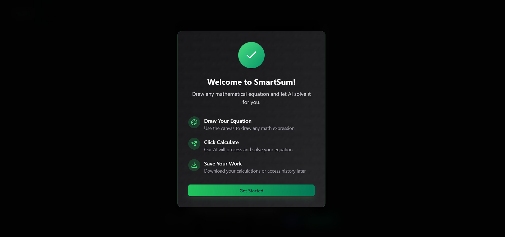
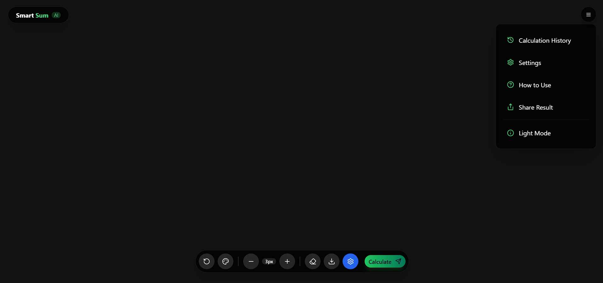
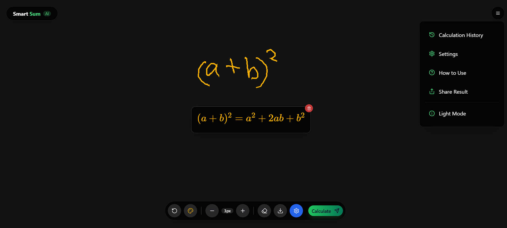
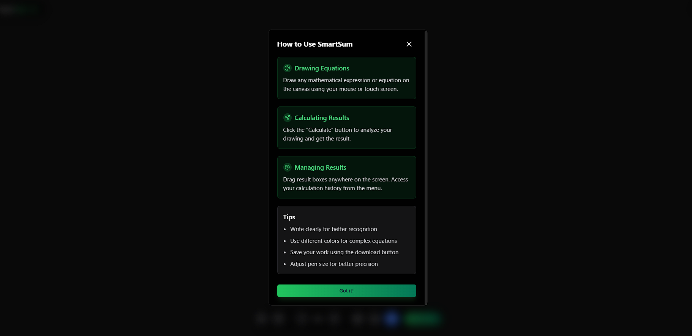

# SmartSum AI - Intelligent Handwriting Calculator

<div align="center">
  
  
  [](https://smart-sum-ai.vercel.app/)
  [](https://github.com/Ak-Rajak/SmartSum-AI)
  [](https://smartsum-ai-backend.onrender.com)
</div>

## 🚀 Overview

SmartSum AI is an intelligent handwriting recognition calculator that allows users to draw mathematical expressions on a canvas and get instant AI-powered solutions. Built with cutting-edge technologies including React, TypeScript, and Google's Gemini API for advanced mathematical computation.

### ✨ Key Features

- 🎨 **Intuitive Drawing Canvas** - Draw mathematical expressions naturally with mouse or touch
- 🧠 **AI-Powered Recognition** - Advanced handwriting recognition using Google Gemini API
- 🎯 **Real-time Calculation** - Instant mathematical solutions for complex equations
- 📱 **Responsive Design** - Works seamlessly on desktop, tablet, and mobile devices
- 🎨 **Customizable Interface** - Multiple colors, brush sizes, and themes
- 📖 **Calculation History** - Save and revisit previous calculations
- 💾 **Export Functionality** - Save your work as images
- 🌙 **Dark/Light Theme** - Toggle between elegant themes
- 📱 **PWA Ready** - Install as a progressive web app

## 🎯 Demo

### 🌐 Live Application
**[Try SmartSum AI Live →](https://smart-sum-ai.vercel.app/)**

### 📸 Screenshots

<div align="center">
  
  
</div>

### 🎬 Quick Demo


## 🛠️ Tech Stack

### Frontend
- **React 18** - Modern UI library with hooks
- **TypeScript** - Type-safe development
- **Vite** - Lightning-fast build tool
- **Tailwind CSS** - Utility-first styling
- **Mantine** - Rich component library
- **Lucide React** - Beautiful icons
- **Axios** - HTTP client for API calls
- **React Hot Toast** - Elegant notifications

### Backend
- **FastAPI** - High-performance Python web framework
- **Google Gemini API** - Advanced AI for mathematical computation
- **CORS Middleware** - Cross-origin resource sharing
- **Render** - Cloud deployment platform

### Development Tools
- **ESLint** - Code linting and formatting
- **PostCSS** - CSS processing
- **TypeScript** - Static type checking

## 🚀 Getting Started

### Prerequisites
- Node.js 18+ and npm
- Modern web browser
- Internet connection for AI processing

### 📥 Installation

1. **Clone the repository**
   ```bash
   git clone https://github.com/Ak-Rajak/SmartSum-AI.git
   cd SmartSum-AI
   ```

2. **Install dependencies**
   ```bash
   npm install
   ```

3. **Set up environment variables**
   ```bash
   cp .env.example .env.local
   ```
   
   Update `.env.local` with your configuration:
   ```env
   VITE_API_URL=https://smartsum-ai-backend.onrender.com
   ```

4. **Start development server**
   ```bash
   npm run dev
   ```

5. **Open your browser**
   Navigate to `http://localhost:5173`

### 🏗️ Build for Production

```bash
# Build the project
npm run build

# Preview production build
npm run preview
```

## 📖 Usage Guide

### ✏️ Drawing Equations
1. Use your mouse or touch to draw mathematical expressions on the canvas
2. Choose from various colors and brush sizes for clarity
3. Draw naturally - the AI recognizes handwritten math notation

### 🧮 Getting Solutions
1. Click the **"Calculate"** button after drawing your equation
2. The AI processes your handwriting and provides the solution
3. Results appear as draggable cards on the canvas

### 🎨 Customization
- **Colors**: Choose from 12 predefined colors or set custom ones
- **Brush Size**: Adjust from 1px to 20px for precision
- **Themes**: Toggle between dark and light modes
- **Canvas**: Clear, reset, or save your work anytime

### 📚 History & Management
- Access calculation history from the menu
- Reload previous calculations
- Export your work as PNG images
- Share results with others

## 🔧 Configuration

### Environment Variables

| Variable | Description | Default |
|----------|-------------|---------|
| `VITE_API_URL` | Backend API endpoint | `http://localhost:8900` |

### 📁 Project Structure

```
src/
├── components/          # Reusable UI components
│   └── ui/             # Styled components
├── lib/                # Utility functions and constants
├── screens/            # Main application screens
│   └── home/          # Home page with calculator
├── assets/            # Static assets
└── styles/           # Global styles and themes
```

## 🔗 API Integration

The frontend communicates with a FastAPI backend that processes handwriting recognition using Google's Gemini API:

- **Endpoint**: `POST /calculate`
- **Payload**: Canvas image data and variable dictionary
- **Response**: Mathematical expressions and computed results

### 🛠️ Backend Repository
The backend is built with FastAPI and deployed on Render. [View Backend Repository →](https://github.com/Ak-Rajak/SmartSum-AI-Backend)

## 🚀 Deployment

### Vercel (Recommended)
1. Push your code to GitHub
2. Connect your repository to Vercel
3. Add environment variables in Vercel dashboard
4. Deploy automatically on every push

### Alternative Platforms
- **Netlify**: Drag & drop the `dist` folder
- **GitHub Pages**: Use `gh-pages` for static deployment

## 🤝 Contributing

We welcome contributions! Please follow these steps:

1. **Fork the repository**
2. **Create a feature branch**
   ```bash
   git checkout -b feature/amazing-feature
   ```
3. **Commit your changes**
   ```bash
   git commit -m 'Add amazing feature'
   ```
4. **Push to the branch**
   ```bash
   git push origin feature/amazing-feature
   ```
5. **Open a Pull Request**

## 📝 License

This project is licensed under the MIT License - see the [LICENSE](LICENSE) file for details.

## 👥 Authors

- **Ak-Rajak** - *Lead Developer* - [@Ak-Rajak](https://github.com/Ak-Rajak)

## 🙏 Acknowledgments

- Google Gemini API for powerful mathematical computation
- React and Vite communities for excellent tooling
- Mantine and Tailwind CSS for beautiful UI components
- Vercel and Render for reliable hosting platforms

## 📞 Support

- 🐛 **Bug Reports**: [Open an issue](https://github.com/Ak-Rajak/SmartSum-AI/issues)
- 💡 **Feature Requests**: [Start a discussion](https://github.com/Ak-Rajak/SmartSum-AI/discussions)
- 📧 **Contact**: [your-email@example.com](mailto:smartSum@example.com)

---

<div align="center">
  <p>Made with ❤️ by <a href="https://github.com/Ak-Rajak">Ak-Rajak</a></p>
  <p>
    <a href="https://smart-sum-ai.vercel.app/">Live Demo</a> •
    <a href="https://github.com/Ak-Rajak/SmartSum-AI">GitHub</a> •
    <a href="https://smartsum-ai-backend.onrender.com">API</a>
  </p>
</div>